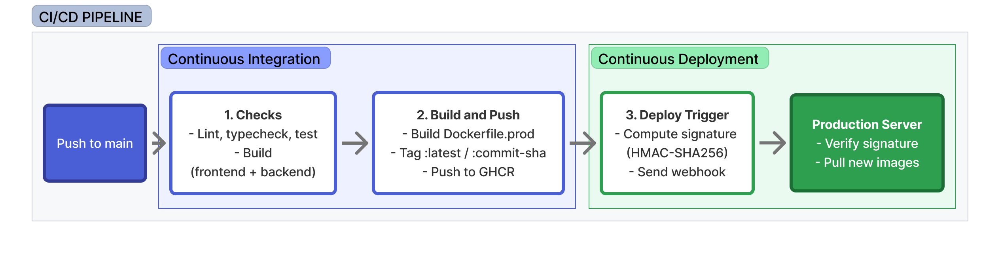

# Watched


A full-stack movie/TV watchlist app, using the TMDB API.

## Features

- User accounts and profiles
- Library: watched / to watch
- Filter, sort and view library as grid/list
- Collections: organize your library
- Rate titles and add notes
- TV shows: track episodes per season
- Search, get data and posters from TMDB

## Stack

- Frontend: React, Vite, Tailwind CSS
- Backend: NestJS
- Database: PostgreSQL
- ORM: Prisma
- Containerization: Docker, Docker Compose
- Nginx
- Networking: Cloudflare Tunnel (optional)
- CI/CD: GitHub Actions + webhook

## Instructions

Requires Docker and Docker Compose.

### Quick start

⚠️ A [TMDB API](https://developer.themoviedb.org/docs/getting-started) key is required.

```bash
# copy and fill env
cp .env.example .env

# start in dev mode
make dev

# start in prod mode
make prod
```

### Cloudflare Tunnel

Expose the app publicly via [Cloudflare Tunnel](https://developers.cloudflare.com/tunnel/).

Create a tunnel in **Protect & Connect → Networking → Tunnels** then add a "Published application" route to `http://frontend:80`.

```bash
# build prod and start tunnel
make cloud
```

⚠️ `CLOUDFLARE_TOKEN` and `CLOUD_URL` need to be filled in `.env`.

Optional: if you want to setup auto-deploy (CD) via webhook, create a route to `http://host.docker.internal:9000` that will be your deploy public URL.

### Commands

| Command                     | Description              |
| --------------------------- | ------------------------ |
| `make dev`                  | Start in dev mode        |
| `make prod`                 | Start in prod mode       |
| `make cloud`                | Prod + Cloudflare Tunnel |
| `make deploy`               | Deploy (cloud)           |
| `make down`                 | Stop all containers      |
| `make redev`                | Rebuild and start dev    |
| `make reprod`               | Rebuild and start prod   |
| `make logs`                 | View logs                |
| `make backend-shell`        | Open backend shell (dev) |
| `make db-shell`             | Open db shell (dev)      |
| `make migrate`              | Prisma migration (dev)   |
| `make prisma`               | Open Prisma Studio (dev) |
| `make db-dump`              | Dump database            |
| `make db-restore FILE=path` | Restore a dump           |
| `make db-wipe`              | Delete db volume         |
| `make tmdb-refresh`         | Refresh db from TMDB     |

## CI/CD

Push to `main` runs checks, builds Docker images, pushes them to GHCR, then auto-deploys on the production server via a webhook.



**Continuous Integration (CI)**

- Run checks: lint, typecheck, test and build, for frontend and backend.
- Build and push: build images from `Dockerfile.prod`, tag `:latest` / `:commit-sha` then push to GHCR.

**Continuous Deployment (CD)**

- Compute HMAC-SHA256 signature of the payload and send it to [webhook](https://github.com/adnanh/webhook).
- Production server verifies signature, pulls the new images and restarts production.

### Setup

**GitHub**

Add these variables in **Settings → Secrets and variables → Actions**:

| Name                 | Type   | Value |
| -------------------- | ------ | --- |
| `DEPLOY_WEBHOOK_URL` | Secret | e.g.: `https://deploy.yourdomain.com/hooks/deploy-watched` |
| `WEBHOOK_SECRET`     | Secret | Same value as `WEBHOOK_SECRET` in `.env` |

⚠️ Without `DEPLOY_WEBHOOK_URL` and `WEBHOOK_SECRET` set, the pipeline still builds and pushes images to GHCR but skips the deploy step.

To pull private images on the server: create a GHCR PAT (scope: `read:packages`) at [github.com/settings/tokens](https://github.com/settings/tokens) and auth to GHCR using `docker login` and generated PAT (see below).

**Production server**

```bash
# create dedicated user
sudo adduser --system --group --home /opt/watched deploy
sudo usermod -aG docker deploy

# clone + configure
sudo -u deploy git clone https://github.com/jeromeberg/watched.git /opt/watched
cd /opt/watched
sudo -u deploy cp .env.example .env
# fill in .env (WEBHOOK_SECRET must match GitHub secret)

# auth to private GHCR
sudo -u deploy docker login ghcr.io -u <username> -p <PAT>

# install webhook
sudo apt update && sudo apt install -y webhook
sudo cp deploy/webhook.service /etc/systemd/system/webhook.service
sudo systemctl daemon-reload
sudo systemctl enable --now webhook.service

# first deployment
sudo -u deploy make deploy
```

### Maintenance

**Logs:**

```bash
journalctl -u webhook -f
tail -f /opt/watched/deploy/deploy.log
```

**Rollback:**

```bash
make deploy IMAGE_TAG=<commit-sha>
```

